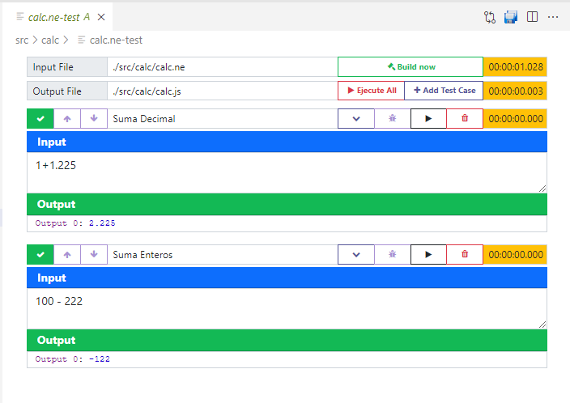

# VSCode-Nearley-Plugin

Plugin for Nearley Grammar - https://nearley.js.org

## Features

- Compile *ne* files with command CTRL + ENTER
    - Generate grammar js file ( [grammar].js )
    - Generate grammar test file ( [grammar].ne-test )
- Ejecute *ne-test* files with command CTRL + ENTER
    - Generate *ne.js* ejecutor on root project directory
    - Display result on editor





## Requirements

- Node global command
- Nearley in local project

## Extension Settings


## Compile

- Compile React View

```bash
$ cd /this/project/path
$ cd view
$ yarn run build:vscode
```
- Compile Nearley Plugin

```bash
$ cd /this/project/path
$ code .
$ # F5 run plugin
```

## Known Issues


## Release Notes


### 1.0.0

Initial plugin

-----------------------------------------------------------------------------------------------------------

### Source Code

* [Source Code](https://github.com/yracnet/vscode-nearley-plugin)

**Enjoy!**
